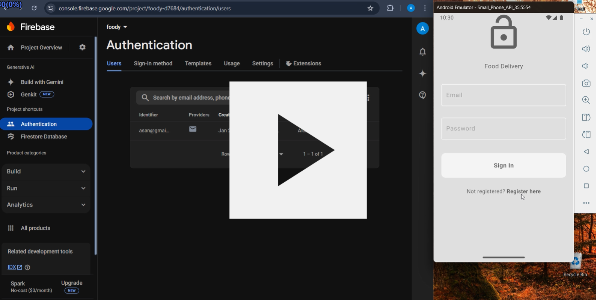
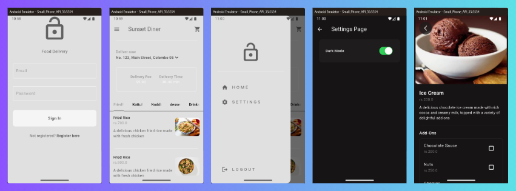
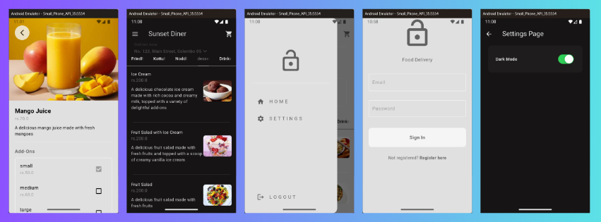

# **Foody - Food Delivery App**

## 🌟 **Overview**
**Foody** is a modern and efficient **Food Delivery Application** built using **Flutter** and powered by **Firebase**. This app is designed to connect users with restaurants seamlessly while ensuring a delightful user experience through features like dynamic theming, state management, and real-time interactions.

---

### 🎥 **Video Demo**
  
Click the image to watch the demo video.

### **Screenshots**
  
  

---

## 🛠️ **Features**
### 1. **User Authentication**
- Register new users and log in securely.
- Powered by Firebase Authentication.

### 2. **Restaurant Management**
- View restaurants and their menu options.
- Add items to the cart and manage orders efficiently.

### 3. **Dynamic Theme Switching**
- Toggle between dark and light modes effortlessly.
- Settings managed via the **Provider** package for state management.

### 4. **Cart and Order Management**
- Update cart items in real-time.
- Calculate order totals and generate receipts.

### 5. **Real-Time Updates**
- Data stored and updated using Firebase.
- Ensure smooth syncing of information like order status and menu updates.

---

## ⚙️ **Technologies Used**

- **Frontend Framework**: Flutter  
- **Backend Services**: Firebase (Authentication, Firestore, Cloud Functions)  
- **State Management**: Provider Package  
- **UI Design**: Material Design Components  

---
